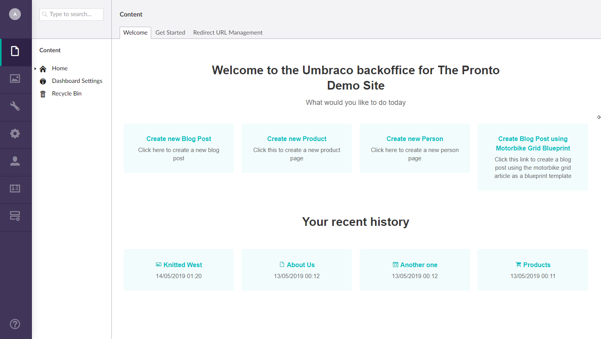

# Pronto
A Dashboard Package for Umbraco which aims to speed up your editor's workflow

It gives you a content node where you can add links to show on the welcome dashboard when the user logs into umbraco.

It also gives the user a recent history, giving them links to the items they have recently edited.

### Backoffice login details

**Username**: admin@admin.com

**Password**: 1234567890
